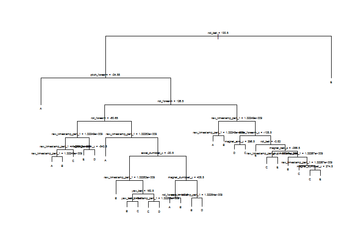
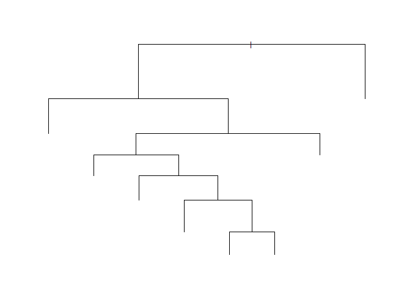
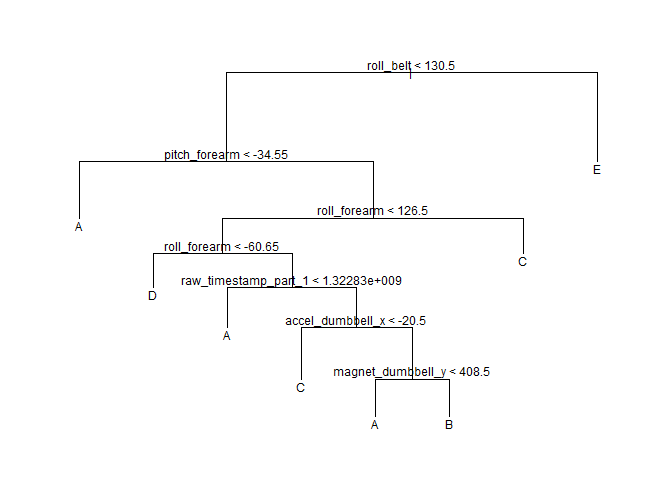
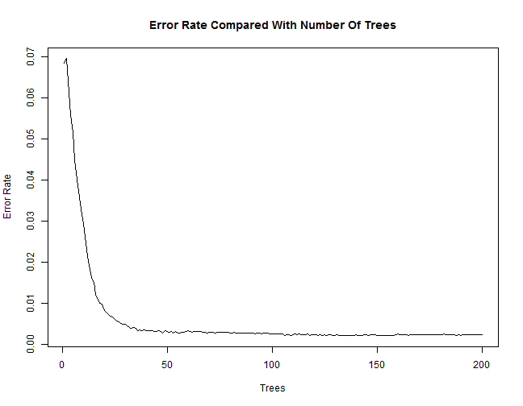
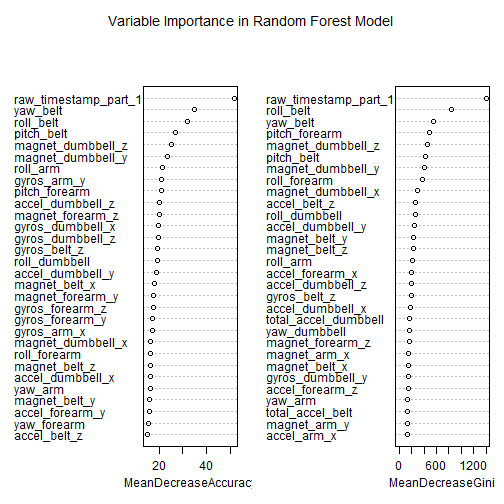

Using Random Forests to Predict Quality of Exercise
========================================================
<hr  color="darkblue">
Introduction
--------------------------------------------------------
Eduardo Velloso et al., in their paper <i>Qualitative Activity Recognition of Weight Lifting Exercises</i>, demonstrate sensor- and model-based approaches to assessing the quality of execution of a weight lifting exercise and providing feedback to the user.  For their experiment, they had six human males perform a biceps curl in varying ways: perfectly (A), elbows to the front (B), dumbbell lifted halfway ( C), dumbbell lowered halfway (D), and throwing hips forward (E).  Inertial Mesurement Units, which provide acceleration, gyroscope, and magentometer data in all 3 axes, were placed in three spots on the user (glove, upper arm, lumbar region) and in one spot on the dumbbell.  Velloso et al. used the Random Forest algorithm to classify the data, and the point of my project was to see if I could use Random Forest techniques and produce similar results. 

Methods
--------------------------------------------------------
The dataset I had to work with had to be cleaned up before I could perform an analysis.  In a sense, there were two types of records distinguished by either having a "new window" or not.  Those with the new window contained more data than those without, e.g. kurtosis, skewness, standard deviation, and variance.  One option was to remove those records (which comprised only about 2% of the data), but I chose to leave them in, and remove the extra columns.  The columns had to be removed even if I had deleted the "yes new window" records since they contained no data for the "no new window" records, and by leaving the records in, I was left with a larger dataset (admittedly not by much).  I divided this dataset into a training set (70% of the original) and a test set (30%) using the <code>createDataPartition</code> function in the <code>caret</code> package.

With a clean dataset, I started by making a single tree using the <code>tree</code> package, and used it to predict the test set.  Next, I used <b>cross-validation</b> to determine the size of the optimal tree, and used this data to create a pruned tree.  The pruned tree was used to predict the test set.  

To build a more accurate model, I used the Random Forest algorithm as implemented in the <code>randomForest</code> package, and used the result to predict the test set.  

Results and Discussion
-------------------------------------------------------
The single tree had many branches (Fig. 1), and seemed to inherently overfit the data.  I include the tree just to show its structure but did not attempt to make the text readable.  
 

Figure 1. Single tree produced from training data.    
<br>
<br>
<br>
<br>
The result of using the single-tree model to predict the test set resulted in the following probability table:

```
##         predict
## observed    A    B    C    D    E
##        A 0.75 0.01 0.05 0.19 0.00
##        B 0.24 0.25 0.09 0.23 0.20
##        C 0.14 0.02 0.62 0.12 0.10
##        D 0.20 0.15 0.05 0.55 0.04
##        E 0.15 0.02 0.04 0.09 0.70
```

The results are quite a bit better at predicting the class (A-E) than flipping a coin, but they are not great.  Could pruning the tree help?  I used <b>cross-validation</b> (via the <code>cv.tree</code> function in the <code>tree</code> package) to determine what the optimal number of branches would be.  Figure 2 shows the <b>cross-validation</b> results, and indicates that 8 or 9 branches will produce the least deviance.  I chose to prune the tree to 8 branches (simpler is generally preferable), and used the resulting tree (Fig. 3) to predict the test set.
 

Figure 2. Deviance vs Number of Branches as determined by cross-validation 
<br>
<br>
<br>
<br>
  

Figure 3. Pruned tree without and with labels
<br>
<br>
<br>
<br>
The resulting probability table shows that the pruned tree is not better ( worse in many ways), but it is possible that it will perform better on a novel set, i.e. it may generalize better than the original tree.  

```
##         predict
## observed    A    B    C    D    E
##        A 0.66 0.00 0.27 0.07 0.00
##        B 0.11 0.20 0.49 0.20 0.00
##        C 0.01 0.02 0.87 0.10 0.00
##        D 0.03 0.14 0.54 0.30 0.00
##        E 0.00 0.02 0.34 0.18 0.46
```


In building the Random Forest model, I originally used 500 trees, but subsequent analysis showed that fewer trees were needed to find the optimal tree.  The best way to see this is to plot the error rate vs the number of trees.  Figure 4 shows that 100 trees produces a nearly optimal tree - indeed 25 trees does most of the work.  

```
## randomForest 4.6-10
## Type rfNews() to see new features/changes/bug fixes.
```

 

Figure 4. Error Rate vs Number of Trees in Random Forest Model
<br>
<br>
<br>
<br>
Using 200 trees, the <b>OOB</b> error rate was 0.23%:  

```
## 
## Call:
##  randomForest(formula = classe ~ ., data = training, prox = TRUE,      ntree = 200, importance = T) 
##                Type of random forest: classification
##                      Number of trees: 200
## No. of variables tried at each split: 7
## 
##         OOB estimate of  error rate: 0.23%
## Confusion matrix:
##      A    B    C    D    E class.error
## A 3905    1    0    0    0    0.000256
## B    6 2652    0    0    0    0.002257
## C    0    5 2389    2    0    0.002922
## D    0    0   12 2236    4    0.007105
## E    0    0    0    1 2524    0.000396
```


I used the resulting model to predict the test set.  The probability table shows the model predicted perfectly.  Of course the real test is on a novel dataset.  

```
## randomForest 4.6-10
## Type rfNews() to see new features/changes/bug fixes.
```

```
##         predict
## observed A B C D E
##        A 1 0 0 0 0
##        B 0 1 0 0 0
##        C 0 0 1 0 0
##        D 0 0 0 1 0
##        E 0 0 0 0 1
```


Cross validation is effectively done within the process of random forests.  As Leo Breiman, who introduced and developed random forests, says on his website (http://www.stat.berkeley.edu/~breiman/RandomForests/cc_home.htm), "[an] unbiased estimate of the test set error . . . is estimated internally, during the run, as follows: Each tree is constructed using a different bootstrap sample from the original data.  About one-third of the cases are left out of the bootstrap sample and not used in the construction of the kth tree."  The <code>randomForest</code> function uses this feature of the algorithm to calculate the <b>OOB/Out</b> of Sample error rate.  

It is certainly possible that I could have made a simpler model by removing some of the variables.  Figure 5 shows some of the variables and their mean decrease in accuracy and the gini impurity criterion.
<br>
<br>
<br>
<br>
 

Figure 5. Plot of Variable Importance
